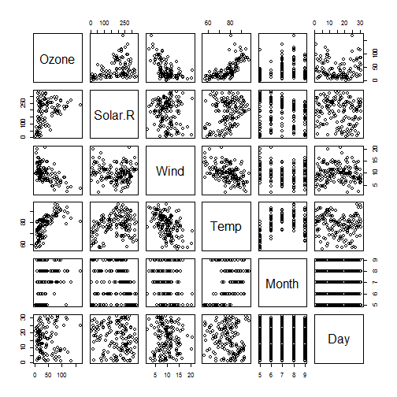

Trial run - proof of concept
============================

This R markdown file is me running through one of everything and getting it on to github.  So that way, I know that I have the circuit ready to go and I can deal with doing it again with the content of the *course 5 - week 2* assignment.

The four kinds of things are
free-form writing

R code

R code output

plots


```r
library(datasets)
data(airquality)
summary(airquality)
```

```
##      Ozone           Solar.R           Wind             Temp      
##  Min.   :  1.00   Min.   :  7.0   Min.   : 1.700   Min.   :56.00  
##  1st Qu.: 18.00   1st Qu.:115.8   1st Qu.: 7.400   1st Qu.:72.00  
##  Median : 31.50   Median :205.0   Median : 9.700   Median :79.00  
##  Mean   : 42.13   Mean   :185.9   Mean   : 9.958   Mean   :77.88  
##  3rd Qu.: 63.25   3rd Qu.:258.8   3rd Qu.:11.500   3rd Qu.:85.00  
##  Max.   :168.00   Max.   :334.0   Max.   :20.700   Max.   :97.00  
##  NA's   :37       NA's   :7                                       
##      Month            Day      
##  Min.   :5.000   Min.   : 1.0  
##  1st Qu.:6.000   1st Qu.: 8.0  
##  Median :7.000   Median :16.0  
##  Mean   :6.993   Mean   :15.8  
##  3rd Qu.:8.000   3rd Qu.:23.0  
##  Max.   :9.000   Max.   :31.0  
## 
```

That is a demonstration of R code and R code output.  So those are the first three.

Note for the future - don't forget about the locale issue.  Gianfranco Campana points out that it might hurt reproducibility if the code hardcodes "Saturday","Sunday", etc, yet the weekdays() function might generate languages besides English, in which case a test for the hardcoded strings would fail.  Excellent point.  So he deals with this by hardcoding the locale:


```r
Sys.setlocale(category = "LC_ALL", locale = "C")
```

```
## [1] "C"
```

So the above doubles as something real I am going to want to do in the real assignment, as well as an example of R code, prefaced by a plain text narrative.

The other kind of thing to run through here is a plot:


```r
pairs(airquality)
```



This is cool and indeed very natural.

Now I want to get this rmd into my repo. This assignment has a lot to it because there is a lot of substance which is roughly as involved as the prior assignments where the ultimate product was R code files (usually with written comments) and image files of plots, or something- AND, from the other end, there is this new stuff just solely about this certain way of rendering.  So there is quite a bit to do, which you could possibly consider as one chunk having to do with content and one chunk having to do with form.  And I have all of my notes offline about the content, but this thing here amounts to a dummy runthrough of the form, so that I at least know I am not going to get snagged on something time consuming around form, and have the substance held hostage til I work out what is going on with aesthetics or formats or something.
