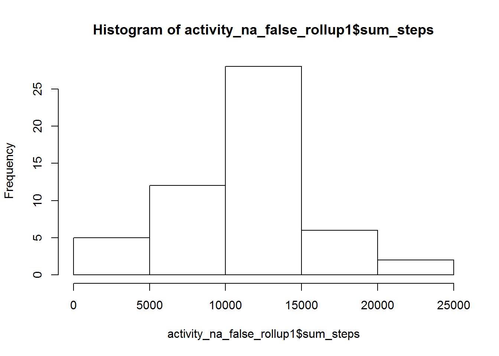
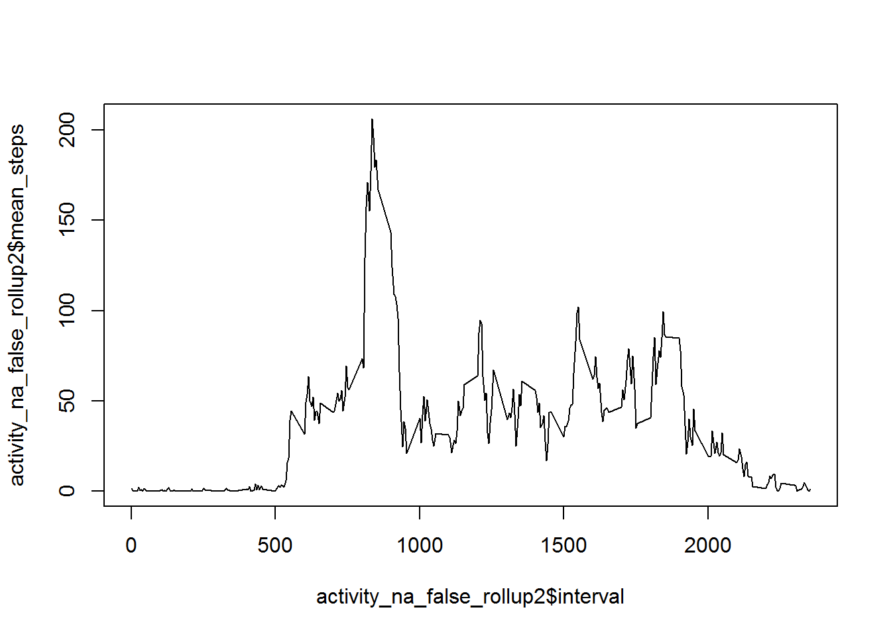
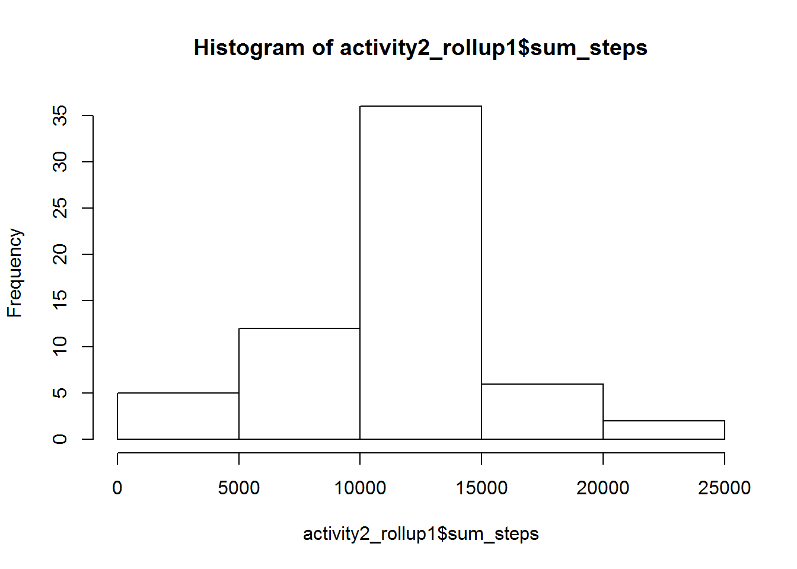
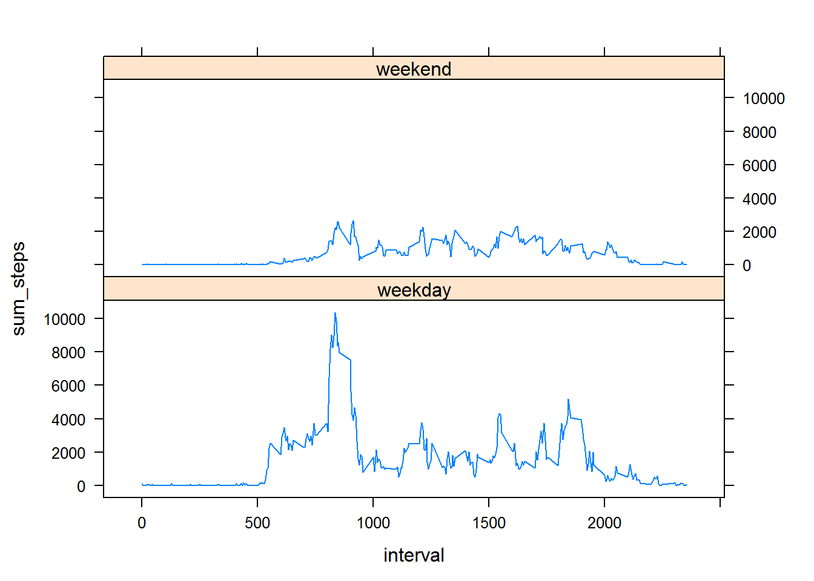

This is the Data Science Course 5, Week 2 assignment.  Please fasten your seatbelt.

The following integrated document is going to contain a mixture of the following things:

(a) Original question text repeated from the assignment on Coursera, so that the assignment sections in this markdown file will have the same structure as in the original,

(b) My own narrative and remarks to make it flow and create context

(c) R code chunks

(d) R code output

(e) Inline plots

Preliminary note about locale

Gianfranco Campana points out that the weekdays() function will generate days of the week based on locale, and not necessarily in English.  This could hurt reproducibility in case the code then tests for hardcoded strings like 'Saturday'.  Excellent point.  So I am going to explicitly set locale:


```r
Sys.setlocale(category = "LC_ALL", locale = "C")
```

```
## [1] "C"
```


Loading and preprocessing the data

Another assumption: I assume that the working directory is set to the location of activity.csv.

Load up several hipstr utility libraries ending in 'r':

```r
library("tidyr");library(stringr);library("plyr");library("dplyr");library("knitr")
```

Load up lattice in spite of the fact that it does not adhere to the hipstr naming convention:

```r
library(lattice)
```


```r
activity <- read.csv("activity.csv")
activity_na_false <- na.omit(activity)
activity_na_true <- subset(activity,is.na(activity$steps) == TRUE)
nrow(activity)
```

```
## [1] 17568
```

```r
nrow(activity_na_false) + nrow(activity_na_true)
```

```
## [1] 17568
```


Part one: hist and values with NA's omitted


```r
activity_na_false_rollup1 <- ddply(activity_na_false,.(date),summarize,sum_steps=sum(steps))
hist(activity_na_false_rollup1$sum_steps)
```



```r
mean(activity_na_false_rollup1$sum_steps)
```

```
## [1] 10766.19
```

```r
median(activity_na_false_rollup1$sum_steps)
```

```
## [1] 10765
```

Part two: time series


```r
activity_na_false_rollup2 <- 
ddply(activity_na_false,.(interval),summarize,mean_steps=mean(steps))
plot(activity_na_false_rollup2$interval,activity_na_false_rollup2$mean_steps,type="l")
```



```r
max_interval <- subset(activity_na_false_rollup2, activity_na_false_rollup2$mean_steps == max(activity_na_false_rollup2$mean_steps))
```


Part three: what is the strategy for imputing?  Do this strategy and make a new dataset


```r
activity_na_derived <- merge(activity_na_true, activity_na_false_rollup2, by.x="interval",by.y="interval")

activity_na_derived_for_rbind <- activity_na_derived[-2]

activity_na_derived_for_rbind = rename(activity_na_derived_for_rbind,steps=mean_steps)

activity2 <- rbind(activity_na_false,activity_na_derived_for_rbind)
```


Part four: Rerun the histogram now that missing data has been resolved.

Is there a difference?


```r
activity2_rollup1 <- ddply(activity2,.(date),summarize,sum_steps=sum(steps))
hist(activity2_rollup1$sum_steps)
```



```r
mean(activity2_rollup1$sum_steps)
```

```
## [1] 10766.19
```

```r
median(activity2_rollup1$sum_steps)
```

```
## [1] 10766.19
```

Part five: Differentiate weekends from weekdays and run a panel plot of the time series, only broken down by weekend/weekday

Is there a difference in number of steps taken on the weekday and weekend?


```r
activity2$DOW <- weekdays(as.POSIXct(activity2$date))
activity_weekend <- subset(activity2,DOW %in% c("Saturday","Sunday"))
activity_weekday <- subset(activity2,DOW %in% c("Monday","Tuesday","Wednesday","Thursday","Friday"))

activity_weekend$plotfactor <- "weekend"
activity_weekday$plotfactor <- "weekday"

activity3 <- rbind(activity_weekend,activity_weekday)

nrow(activity3)
```

```
## [1] 17568
```

```r
activity_weekend_rollup <- ddply(activity_weekend,.(interval),summarize,sum_steps=sum(steps))
activity_weekday_rollup <- ddply(activity_weekday,.(interval),summarize,sum_steps=sum(steps))
activity_weekend_rollup$day_group <- "weekend"
activity_weekday_rollup$day_group <- "weekday"
activity_for_panel <- rbind(activity_weekend_rollup,activity_weekday_rollup)
xyplot(sum_steps~interval | day_group ,data=activity_for_panel,layout=c(1,2),type="a")
```




